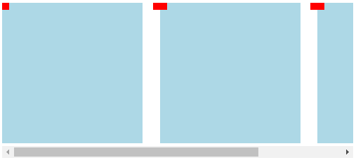
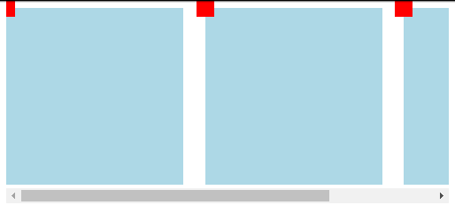

[CSS中overflow-y: visible;不起作用的原因分析及解决方法](https://www.jb51.net/css/636587.html)
===
最近要做的一个需求是移动端的h5页面，要求有一排可选择的卡片, 超出容器部分可以左右滑动，同时每张卡片左上角要有一个删除按钮。如下图：


心想：so easy, 在父容器上加一个`max-width: 200px; white-space: nowrap; overflow-x: auto;`不就搞定了嘛。Demo如下：
```javascript
<div class="container">
  <div class="son">
    <div class="delete_btn"></div>
  </div>
  <div class="son">
    <div class="delete_btn"></div>
  </div>
  <div class="son">
    <div class="delete_btn"></div>
  </div>
</div>
.container {
  max-width: 500px;
  overflow-x: auto;
  white-space: nowrap;
}
.son {
  display: inline-block;
  width: 200px;
  height: 200px;
  background-color: lightblue;
  position: relative;
  margin-right: 20px;
}
.delete_btn {
  width: 20px;
  height: 20px;
  position: absolute;
  top: 0;
  left: 0;
  background-color: red;
  transform: translateX(-50%) translateY(-50%);
}


```


原本以为一切顺利，结果得到的结果如图：

看第一个矩形左上角的红色方块，原本为`20 * 20`的红色方块有一部分被隐藏了。我想应该是overflow影响的，所以想通过`overflow-y: visible;`来解决,结果是不行的。细心的朋友应该记得overflow的默认值就是`visible`。那么原因是什么呢？

Why

找了好久，大致了解到是如下原因

`The computed values of ‘overflow-x’ and ‘overflow-y’ are the same as their specified values, except that some combinations with ‘visible’ are not possible: if one is specified as ‘visible’ and the other is ‘scroll’ or ‘auto’, then ‘visible’ is set to ‘auto’. The computed value of ‘overflow’ is equal to the computed value of ‘overflow-x’ if ‘overflow-y’ is the same; otherwise it is the pair of computed values of ‘overflow-x’ and ‘overflow-y’.`
大致意思是，当overflow-x为scroll或者auto时，overflow-y被设置为auto，反之亦然。这就很尴尬了，那怎么解决这个问题呢。

ps: 上面那段话说是来自于w3c的文档，但是我找了半天没找到原文，麻烦找到了的小伙伴留个链接~ [手动狗头]

How

终究还是想让左上角的红色方块显示完整的，那么解决方案呢，我这里采用的是在container上添加以下样式

```css
padding-top: 20px;
margin-top: -20px;
```
原理其实挺简单的，加了`padding-top: 20px;`后，绝对定位的红色方块就有空间显示了，不会超出容器体积，然后通过`margin-top: -20px;`抵消位置的变化.如图



ps: 第一个红色方块左边被遮住的部分同样的思路解决，即通过`padding-left`和`margin-left`来处理。

总结

以上所述是小编给大家介绍的CSS中`overflow-y: visible;`不起作用的原因分析及解决方法，希望对大家有所帮助，如果大家有任何疑问请给我留言，小编会及时回复大家的。在此也非常感谢大家对脚本之家网站的支持！


ref: 
